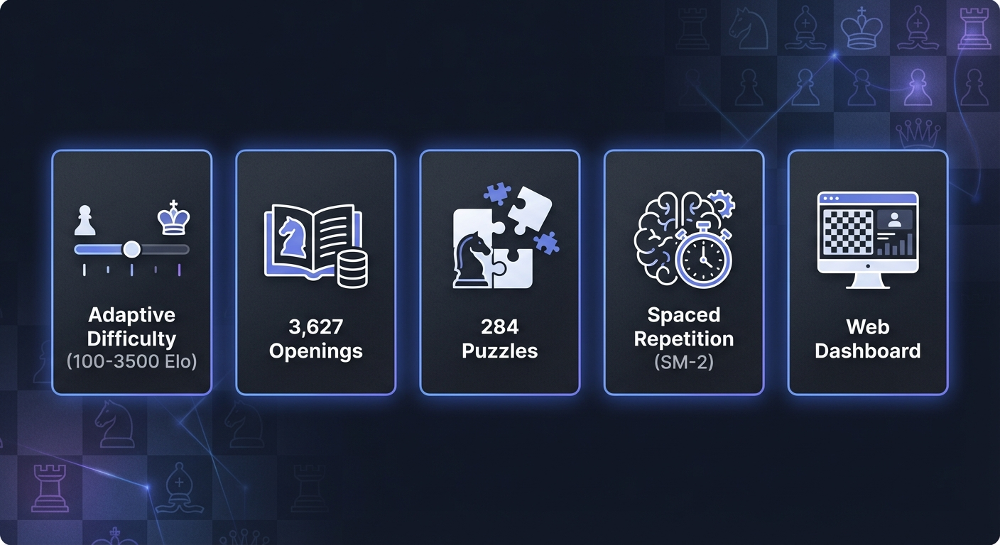
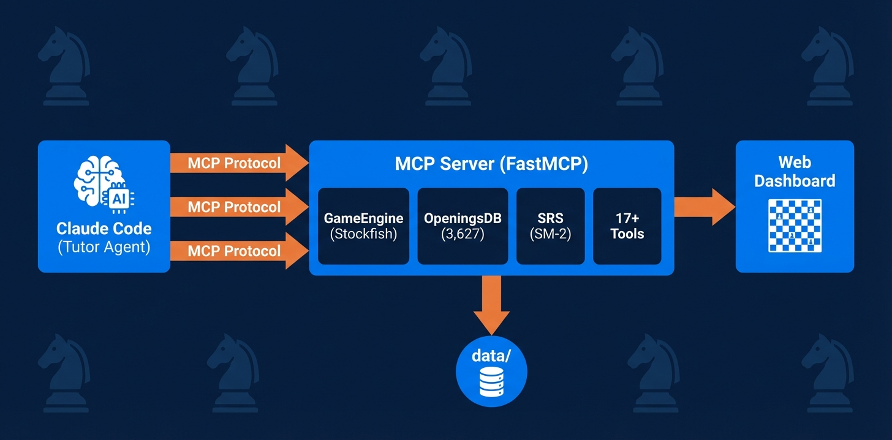

# Chess Rocket


An adaptive chess tutoring system powered by Claude Code that transforms into a personalized chess coach. Combines Stockfish engine analysis with educational psychology to guide learners from beginner (0 Elo) to intermediate (1500 Elo) through structured play, analysis, and spaced repetition.

**Status:** Python 3.10+ | Stockfish Engine | FastMCP | SQLite | Web Dashboard



---

## Overview

Chess Rocket works as a complete learning ecosystem:

1. **Claude Code** connects via MCP (Model Context Protocol) to a chess server
2. **MCP Server** manages 17+ tools for games, analysis, openings, and progress tracking
3. **Stockfish** engine provides position evaluation and engine play
4. **Web Dashboard** displays the live board, moves, evaluation, and opening info in your browser
5. **Spaced Repetition (SM-2)** automatically schedules mistake review for long-term retention

The system implements a **3-perspective tutor**: GM Teacher (strategy), Learning Psychologist (pacing), and Behavioral Specialist (motivation).

---

## How It Works


### Teaching Methodology

Claude acts as a **3-perspective tutor**:

| Role | Function |
|------|----------|
| **GM Teacher** | Position evaluation, pattern recognition, opening principles |
| **Learning Psychologist** | Zone of Proximal Development, spaced rep scheduling, deliberate practice |
| **Behavioral Specialist** | Session pacing, streak tracking, difficulty calibration |

### Core Loop: Play -> Analyze -> Teach -> Replay -> Plan

1. **Play**: You move. Claude evaluates with `evaluate_move()` before responding with engine move.
2. **Analyze**: Claude compares your choice to engine's top moves using `analyze_position()`.
3. **Teach**: Response depth depends on move quality (see thresholds below).
4. **Replay**: After game, Claude walks through 2-3 teaching positions.
5. **Plan**: Session summary + lesson plan + next session goals.

### Move Evaluation Thresholds

| CP Loss | Classification | Teaching Response |
|---------|---------------|-------------------|
| 0 | Best move | Brief acknowledgment ("Excellent!") |
| 1-30 | Great move | Positive reinforcement |
| 31-80 | Good move | Note the slightly better alternative |
| 81-150 | Inaccuracy | Brief teaching: why alternative is better |
| 151-300 | Mistake | Full explanation + principle connection |
| 300+ | Blunder | Immediate intervention + undo offer + add to SRS |

### Language Adaptation

Claude adjusts explanation depth to your level:

| Level | Elo Range | Approach |
|-------|-----------|----------|
| **Beginner** | 0-600 | Simple terms, visual explanations, piece safety focus |
| **Intermediate Beginner** | 600-1000 | Terminology intro, principle-based, tactical patterns |
| **Intermediate** | 1000-1500 | Full technical language, positional play, strategy |

---

## Architecture



---

## Tech Stack

| Component | Technology |
|-----------|-----------|
| Language | Python 3.10+ |
| Chess Engine | Stockfish (UCI protocol) |
| MCP Framework | FastMCP |
| Dashboard | HTML/JS + Python HTTP server |
| Database | SQLite (openings) + JSON (game state) |
| Package Manager | uv |
| Testing | pytest |

---

## Features

### Game Management (17+ MCP Tools)
- Full game lifecycle: `new_game`, `make_move`, `engine_move`, `undo_move`
- Deep analysis: `analyze_position`, `evaluate_move`
- Difficulty control: `set_difficulty` (100-3500 Elo)
- Legal moves, PGN export, board state tracking

### Adaptive Difficulty
- **100-1320 Elo:** Custom linear blend formula with depth-limited Stockfish + random moves
- **1320-3500 Elo:** Direct Stockfish UCI_Elo control
- **Auto-adjustment:** Difficulty scales based on recent accuracy

### Opening Recognition & Study
- **3,627 chess openings** from Lichess database
- Live identification during games (ECO code + name)
- Search by name or ECO code
- Level-appropriate opening suggestions
- Interactive opening quizzes
- Opening trap refutation puzzles

### Spaced Repetition (SM-2 Algorithm)
- Automatic mistake card creation
- Review intervals: 4hr -> 1d -> 3d -> 1wk -> 2wk -> 1mo
- Quality-based progression (0-5 scale)
- Failed reviews reset to 4hr
- Ease factor adjustment per card

### 284 Curated Puzzles (9 Sets)

| File | Motif | Count | Source |
|------|-------|-------|--------|
| `forks.json` | Knight/queen/pawn forks | 28 | Stockfish self-play |
| `pins.json` | Absolute and relative pins | 28 | Stockfish self-play |
| `skewers.json` | Skewer tactics | 28 | Stockfish self-play |
| `back-rank.json` | Back-rank mate threats | 30 | Lichess DB |
| `checkmate-patterns.json` | Checkmate patterns | 30 | Lichess DB |
| `beginner-endgames.json` | Basic endgame positions | 24 | Constructed |
| `opening-moves.json` | Next book move tests | 40 | Opening DB |
| `opening-traps.json` | Opening trap refutations | 30 | Opening DB |
| `from-games.json` | Mistakes from player games | 46 | Game mining |

### Web Dashboard
- Interactive chess board with piece images
- Move list with move numbers
- Evaluation bar (position assessment)
- Current opening name + ECO code
- Material balance tracker
- Real-time board updates via polling

### Post-Game Analysis
- Batch SRS card creation for all mistakes (>80cp loss)
- Puzzle generation from your own games
- Teaching position selection
- Accuracy summary + move classification
- Session logging and progress updates
- PGN auto-save

---

## Project Structure

```
chess_rocket/
+-- mcp-server/
|   +-- server.py              # 17+ MCP tools (game, analysis, openings, utility)
|   +-- openings_tools.py      # Opening recognition (5 tools)
+-- scripts/
|   +-- engine.py              # Stockfish wrapper with adaptive difficulty
|   +-- srs.py                 # SM-2 spaced repetition system
|   +-- dashboard_server.py    # Web dashboard HTTP server
|   +-- dashboard.html         # Web dashboard frontend
|   +-- openings.py            # Opening recognition (trie + SQLite lookup)
|   +-- models.py              # Shared data models (GameState, MoveEvaluation)
|   +-- export.py              # Progress/game markdown reports
|   +-- install.sh             # Setup script
|   +-- build_openings_db.py   # Download & build 3,627 openings
|   +-- generate_puzzles.py    # Tactical puzzle generation pipelines
|   +-- generate_opening_puzzles.py  # Opening puzzle generator
|   +-- import_lichess_puzzles.py    # Lichess puzzle importer
|   +-- validate_puzzles.py    # FEN validation + Stockfish verification
|   +-- motif_detector.py      # Tactical motif detection
+-- references/                # Educational content (7 files)
|   +-- curriculum.md          # 3-phase curriculum framework
|   +-- chess-pedagogy.md      # GM coaching methodology
|   +-- learning-science.md    # Cognitive science foundations
|   +-- elo-milestones.md      # Skills expected by Elo range
|   +-- tactical-patterns.md   # Tactical motifs with examples
|   +-- common-mistakes.md     # Beginner error patterns
|   +-- opening-guide.md       # Level-appropriate openings
+-- puzzles/                   # 284 curated puzzles (9 files)
+-- tests/                     # Test suites
+-- data/                      # Runtime data (generated, gitignored)
+-- CLAUDE.md                  # Tutor agent instructions
+-- SKILL.md                   # Claude Code skill documentation
+-- LICENSE                    # GPL v3
+-- pyproject.toml             # Python project config (uv)
+-- .mcp.json                  # MCP server config (edit path before use)
+-- README.md
```

---

## Getting Started

### Prerequisites
- Python 3.10 or later
- Stockfish chess engine
- uv package manager
- Claude Code (with MCP support)

### Installation

```bash
git clone https://github.com/suvojit-0x55aa/chess_rocket.git
cd chess_rocket
./scripts/install.sh
```

The install script:
1. Installs Stockfish (via Homebrew on macOS, apt on Linux)
2. Installs uv package manager
3. Creates Python virtual environment
4. Initializes `data/` directories and `progress.json`
5. Downloads and builds the 3,627-opening database
6. Validates all puzzle FENs

### MCP Configuration

Chess Rocket connects to Claude Code via MCP. After cloning:

1. Edit `.mcp.json` — replace the placeholder path with your absolute project path:
   ```json
   {
     "mcpServers": {
       "chess-speedrun": {
         "command": "uv",
         "args": ["run", "python", "mcp-server/server.py"],
         "cwd": "/your/absolute/path/to/chess_rocket"
       }
     }
   }
   ```
2. Restart Claude Code — the chess-speedrun MCP server will auto-connect
3. Verify: Ask Claude "What MCP tools do you have?" — you should see 17+ chess tools

### Quick Start

**Terminal 1 — Start the Web Dashboard:**
```bash
uv run python scripts/dashboard_server.py
# Open http://localhost:8088 in your browser
```

**Terminal 2 — Start Claude Code & Play:**
```bash
# Claude connects to the MCP server automatically
# Say: "Let's play chess" or "Start a game"
```

The board appears in your browser and updates in real-time as you play.

---

## Data Setup

All runtime data lives in `data/` (gitignored). The install script sets everything up automatically.

### What `install.sh` creates:
- `data/progress.json` — Initial player profile (400 Elo starting point)
- `data/srs_cards.json` — Empty SRS card deck
- `data/openings.db` — SQLite database of 3,627 chess openings (downloaded from Lichess GitHub)
- `data/openings_trie.json` — JSON trie for fast opening lookup
- `data/sessions/`, `data/games/`, `data/lesson_plans/` — Empty directories for runtime data

### Manual data setup (if not using install.sh):
```bash
# Create directories
mkdir -p data/sessions data/games data/lesson_plans

# Initialize player profile
echo '{"current_elo": 400, "sessions_completed": 0, "streak": 0, "total_games": 0, "wins": 0, "losses": 0, "draws": 0}' > data/progress.json

# Initialize empty SRS deck
echo '[]' > data/srs_cards.json

# Build openings database (downloads ~370KB of TSV from Lichess GitHub)
uv run python scripts/build_openings_db.py
```

### Optional: Regenerate puzzles
The repo ships with 284 curated puzzles in `puzzles/`. To regenerate:
```bash
# Regenerate tactical puzzles via Stockfish self-play (requires Stockfish, ~5 min)
uv run python scripts/generate_puzzles.py --pipeline stockfish

# Regenerate opening puzzles from the openings database
uv run python scripts/generate_puzzles.py --pipeline openings

# Validate all puzzle FENs
uv run python scripts/validate_puzzles.py
```

### Optional: Import Lichess puzzles
For additional puzzles from the Lichess database:
1. Download `lichess_db_puzzle.csv.zst` (~273MB) from https://database.lichess.org/#puzzles
2. Place it in `data/lichess_db_puzzle.csv.zst`
3. Run: `uv run python scripts/import_lichess_puzzles.py --themes backRankMate,fork,pin --max-per-theme 30`

---

## Usage

### Interactive Play

Claude manages the full session:
1. Evaluates your moves before responding
2. Teaches based on move quality (see thresholds below)
3. Tracks opening name during play
4. Offers undo on blunders
5. Analyzes game after completion
6. Creates SRS cards for mistakes

### Standalone Commands

```bash
# Launch web dashboard with sample game data
uv run python scripts/dashboard_server.py
# Then open http://localhost:8088

# Engine analysis of a position
uv run python scripts/engine.py analyze "rnbqkbnr/pppppppp/8/8/8/8/PPPPPPPP/RNBQKBNR w KQkq - 0 1"

# Engine play (one move only)
uv run python scripts/engine.py play 800

# Engine play (interactive game loop)
uv run python scripts/engine.py play 800 --interactive

# View due SRS review cards
uv run python scripts/srs.py due

# Export progress report (markdown)
uv run python scripts/export.py progress

# Export game PGN summaries
uv run python scripts/export.py games

# Run full test suite
uv run python -m pytest tests/ -v
```

---

## MCP Tools Reference

### Game Management (8 tools)
`new_game` | `get_board` | `make_move` | `engine_move` | `undo_move` | `set_position` | `get_legal_moves` | `get_game_pgn`

### Analysis (3 tools)
`analyze_position` | `evaluate_move` | `set_difficulty`

### Openings (5 tools)
`identify_opening` | `search_openings` | `get_opening_details` | `suggest_opening` | `opening_quiz`

### Progress & Learning (4 tools)
`srs_add_card` | `create_srs_cards_from_game` | `generate_puzzles_from_game` | `save_session`

### Puzzle Export (1 tool)
`srs_to_puzzles`

---

## Adaptive Difficulty

The engine automatically adjusts to match your skill:

```
If recent accuracy > 90%:  +100 Elo (too easy)
If recent accuracy 80-90%: +50 Elo (performing well)
If recent accuracy 65-80%: No change (zone of proximal development)
If recent accuracy 50-65%: -50 Elo (struggling)
If recent accuracy < 50%:  -100 Elo (too hard)
```

Sub-1320 Elo uses a custom formula: random move injection + depth limiting (Stockfish's minimum UCI_Elo is 1320).

---

## Opening System

**3,627 openings** from the Lichess database:

- **Live identification**: Opening name displayed during games as you follow book moves
- **ECO search**: Find openings by name or ECO code (B20, E4, etc.)
- **Suggestions**: Get level-appropriate openings to study based on your Elo
- **Quizzes**: Test your opening knowledge with "what's the next move?" challenges
- **Traps**: Learn common opening traps and their refutations

Openings stored in SQLite + JSON trie for fast lookup.

---

## Spaced Repetition (SM-2)

Powered by the **SM-2 algorithm** (industry standard):

- **First review**: 4 hours after mistake
- **Successful reviews advance**: 4hr -> 1d -> 3d -> 1wk -> 2wk -> 1mo
- **Failed reviews reset**: Back to 4hr if quality < 3
- **Quality scale**: 0-2 (failed), 3-5 (passed)
- **Ease factor**: Adjusted per card based on quality history

Claude automatically creates SRS cards for:
- Significant mistakes during games (>80cp loss)
- Manually marked positions
- Opening knowledge gaps

---

## Testing

```bash
# Run all tests
uv run python -m pytest tests/ -v

# Test specific module
uv run python -m pytest tests/test_engine.py -v

# Test coverage report
uv run python -m pytest tests/ --cov=scripts --cov-report=html
```

**Test suites:**
- `test_engine.py` — Stockfish wrapper, adaptive difficulty
- `test_srs.py` — SM-2 algorithm, card scheduling
- `test_openings.py` — Opening identification, search, ECO lookup
- `test_post_game.py` — Game analysis, SRS card creation
- `test_mcp_tools.py` — MCP tool integration tests
- `test_mcp_flows.py` — Multi-tool workflow tests
- `test_puzzle_generation.py` — Puzzle pipeline tests
- `test_motif_detector.py` — Tactical motif detection

---

## Development

### Architecture Decisions

- **Shared Models**: `scripts/models.py` defines `GameState` and `MoveEvaluation` dataclasses used by MCP server and dashboard
- **Atomic Writes**: All JSON updates use temp file + `os.replace()` to prevent corruption
- **Programmatic FEN Validation**: All puzzle FENs validated via `python-chess` before save
- **Sub-1320 Elo**: Linear blend formula for random move injection (Stockfish minimum is 1320)

### Adding New Features

1. **New MCP Tool**: Add to `mcp-server/server.py` with `@mcp.tool()` decorator
2. **New Puzzle Set**: Add JSON file to `puzzles/` with format: `[{"fen": "...", "solution_moves": [...], "theme": "..."}]`
3. **New Reference**: Add markdown file to `references/` and link from `CLAUDE.md`
4. **Opening Support**: Pre-built 3,627 openings; search/quiz/suggest all work automatically

---

## References

- **CLAUDE.md** — Full tutor agent instructions (session flow, teaching methodology, tool reference)
- **SKILL.md** — Claude Code skill documentation (for other agents)
- **references/** — 7 educational materials for the tutor to reference

---

## License

This project is licensed under the [GNU General Public License v3.0](LICENSE).

---

## Contributing

Contributions welcome! To contribute:

1. Fork the repository
2. Create a feature branch (`git checkout -b feature/my-feature`)
3. Make your changes
4. Run tests: `uv run python -m pytest tests/ -v`
5. Commit with a descriptive message
6. Open a Pull Request

Areas of interest:
- Additional puzzle sets or tactical themes
- New reference materials or teaching techniques
- Performance optimizations
- Dashboard enhancements
- Language localization

---

## Support

For issues or questions:
1. Check `CLAUDE.md` for tutor instructions
2. Review `references/` for teaching methodology
3. Run `./scripts/install.sh` to verify setup
4. Run test suite: `uv run python -m pytest tests/ -v`
5. Open an issue on GitHub
